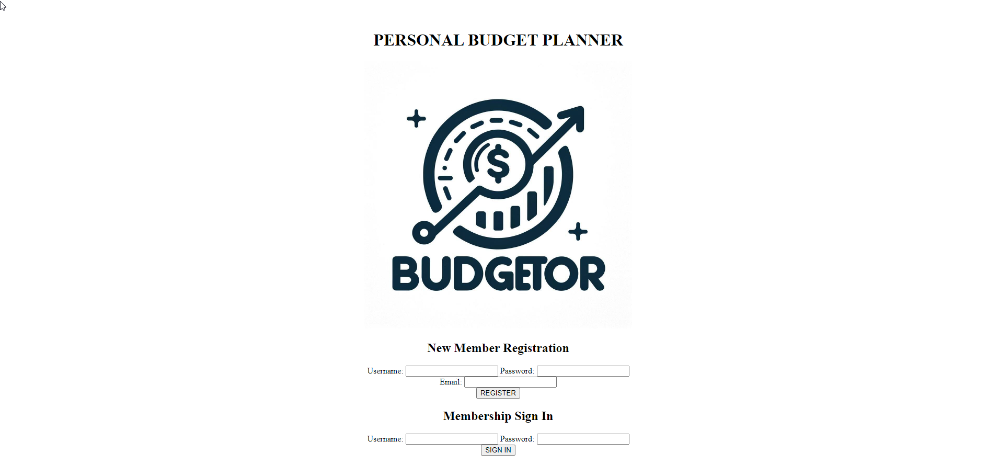

# BUDGETOR Personal Finance Tracker

## Description
BUDGETOR is a simple budgeting application that allows users to keep a heads up on their personal finances. After creating an account, users are able to access a selection of features. On the finances page, users will find three input fields: spontaneous spending, income, and expenses. Each allow the user to enter a name and a value for the transaction. A list with the entered titles will be displayed below, allowing the user to recall their purchases throughout the month. The value is also added to a total which monitors the total incoming and outgoing funds. At the bottom, users will find a budget manager which is a live-updating difference of net income for the month. This shows users how much of their income is remaining for making decisions on purchases and savings allocation. On the other page there is a savings feature. Users are able to set savings goals with a title, and contribute amounts towards that goal. Progress is displayed, and tips on saving are provided. There is also a selection of saving tips, and a compound interest calculator using financejs. The CI calculator allows user to enter information regarding an amount in savings in order to forecast compound interest. 

      
## Table of Contents
- [Installation](#installation)
- [Usage](#usage)
- [License](#license)
- [Contributors](#contributors)
- [Questions](#questions)
      
## Installation
BUDGETOR is deployed live for use at https://budgetor-app-a5ef154a6270.herokuapp.com/.
      
## Usage
Users will be prompted to create an account or login upon accessing the site. After, the features become available. Page navigation can be found near the top of each page.
      
## License
This application is covered under the MIT license.
      
## Contributors
Tyler W., Gurwinder S., Michael R.
      
## Questions
For additional questions, contact [orosunn](https://github.com/orosunn) or email at tylerjdwright1@gmail.com .
